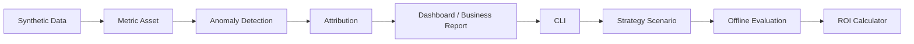

# RiskOps Copilot

面向消费金融贷后策略运营的 AI/Data Copilot Demo，用合成数据模拟指标监控、异常检测、归因、经营报告、策略评估与 ROI 测算闭环。

> Public demo only：本项目只使用 synthetic data / 合成数据；不包含真实客户数据；不产生真实催收动作；不发送短信、语音或 WhatsApp；不做真实金融结论或 LLM 自动决策。

## Why This Project

贷后运营团队面对的典型问题不是“没有数据”，而是数据、指标、异常、归因和动作评估分散在不同工具里：

- **指标多**：回收率、PTP、触达、产能、投诉、减免 ROI 等指标口径容易分散。
- **异常发现慢**：经营波动往往先靠人工巡检、SQL 和 Excel 发现。
- **归因靠经验**：渠道、区域、客群、供应商、作业线和触达链路需要反复下钻。
- **动作缺少量化评估**：发现问题后，AI 外呼补强、人工产能、减免策略、资源再分配是否值得做，缺少统一的离线估算入口。

RiskOps Copilot 把这条链路做成一个本地可运行的公开 Demo：从合成数据开始，经过指标资产、异常检测、归因、Dashboard、经营报告、CLI，再进入策略情景评估和 ROI 测算。

## Product Workflow



## What It Demonstrates

- **数据工程能力**：合成贷后数据、分层数仓、数据质量验证和可复现本地输出。
- **指标体系建设**：以 `metadata/metric_dictionary.yaml` 作为指标口径来源，沉淀贷后经营指标资产。
- **异常检测**：识别 M1 回收率、AI 外呼覆盖、产能压力、减免使用、PTP 履约和投诉风险等信号。
- **归因分析**：围绕渠道、区域、客群分层、作业资源和过程证据解释 M1 D7 回收率下降。
- **经营分析报告**：将异常和归因转成管理者可读的 Markdown / HTML 经营报告。
- **Dashboard**：输出本地静态 Dashboard，服务快速演示和截图。
- **CLI 产品化入口**：用命令行串联 summary、drivers、model-lab、roi 和渲染动作。
- **策略评估**：基于合成数据和 M3 输出做离线策略情景估算，不训练真实模型。
- **ROI 测算**：基于 demo cost assumptions 估算成本、收益、ROI 和 payback，不代表真实财务结果。
- **合规边界意识**：明确 synthetic data、no real customer data、no real collection action、no LLM decisioning。

## Demo Quick Start

这些命令读取或重新渲染本地 synthetic demo outputs；项目不包含真实客户数据，不用于生产风控决策。当前模型目标是 **D7 any-payment response**，不是 cure-to-current、全额回收或生产催收结果建模。

```bash
python scripts/riskops_cli.py --help
python scripts/riskops_cli.py summary
python scripts/riskops_cli.py anomalies
python scripts/riskops_cli.py drivers
python scripts/riskops_cli.py outputs
python scripts/riskops_cli.py scenarios
python scripts/riskops_cli.py strategy-eval
python scripts/riskops_cli.py roi
python scripts/riskops_cli.py model-lab
python scripts/riskops_cli.py render-model-lab
python scripts/riskops_cli.py render-dashboard
python scripts/riskops_cli.py render-report
pytest
```

常用入口说明：

- **--help**：查看当前 CLI 支持的全部 demo 入口。
- **summary**：查看项目状态、异常数量、数据边界和常用命令。
- **anomalies**：查看高优先级异常列表。
- **drivers**：查看 M1 D7 回收率下降 Top 5 drivers 和业务解释边界。
- **outputs**：查看 Dashboard、报告和 M3 输出路径。
- **scenarios**：查看 M6-A 离线策略情景。
- **strategy-eval**：查看 M6-B 离线策略评估摘要。
- **roi**：查看策略情景的成本收益和 ROI 摘要。
- **model-lab**：查看 M6 Strategy Evaluation / ROI 总览和 demo boundary。
- **render-model-lab**：重新生成 strategy evaluation 与 ROI 输出。
- **render-dashboard**：重新生成本地静态 Dashboard。
- **render-report**：重新生成 Markdown / HTML 经营报告。
- **pytest**：运行当前测试集，验证 Demo 主链路未被破坏。

## Key Outputs

- **Dashboard**：`outputs/dashboard/dashboard.html`
  - 本地静态看板，用于快速查看贷后经营状态。
- **Business Report**：`outputs/reports/m4_business_report.md`
  - 面向经营复盘的异常、归因、过程证据和管理动作建议。
- **Strategy Evaluation**：`outputs/model_lab/strategy_eval_summary.md`
  - 5 个离线策略情景的 baseline / scenario / delta / caveats。
- **ROI Summary**：`outputs/model_lab/roi_summary.md`
  - 基于 demo cost assumptions 的成本、收益、ROI 和 payback 估算。

## Milestone Status

为避免终端截断，本节不用 Markdown 表格，改用分组列表呈现。

### v0.1.0 数据底座

- **阶段**：M1 Data Foundation
- **交付**：合成数据、分层数据目录、基础数据生成与隐私边界。
- **状态**：已发布。

### v0.2.0 指标资产

- **阶段**：M2 Metric Asset Layer
- **交付**：贷后 26 个指标字典、calculator registry、ADS 字段对齐。
- **状态**：已发布。

### v0.3.0 异常检测与归因

- **阶段**：M3 Anomaly Detection and Attribution
- **交付**：异常检测、M1 D7 回收率归因、结构化 M3 summary。
- **状态**：已发布。

### v0.4.0 Dashboard & Business Report

- **阶段**：M4 Dashboard and Reports
- **交付**：Static Dashboard、Business Report Renderer、Markdown / HTML 报告输出。
- **状态**：已发布。

### v0.5.0 CLI Interaction MVP

- **阶段**：M5 CLI / Demo Entry
- **交付**：统一 CLI 入口、summary、anomalies、drivers、outputs、render-dashboard、render-report。
- **状态**：已发布。

### v0.6.0 Model Lab Strategy Evaluation MVP

- **阶段**：M6 Strategy Evaluation / ROI
- **交付**：Strategy Scenario Schema、Offline Strategy Evaluator、ROI Calculator、Model Lab CLI integration。
- **状态**：已发布。

## Boundaries

本项目的边界是公开 Demo 可信度的一部分：

- **synthetic data only**：只使用合成数据。
- **no real customer data**：不接入、不提交、不展示真实客户数据。
- **no real financial conclusion**：ROI 和收益只来自 demo assumptions，不代表真实财务结果。
- **no collection automation**：不产生真实催收动作。
- **no SMS / voice / WhatsApp**：不发送短信、语音或 WhatsApp。
- **no LLM decisioning**：不调用 LLM 做自动策略决策。
- **no production claim**：不宣称真实上线、真实收益或真实催收自动化。

## Next

- **M6-D ML Modeling Readiness / Baseline Model**：在不越过合规边界的前提下，评估是否补一个轻量 baseline model 或继续保持规则化模拟。
- **Public demo walkthrough**：把 README、CLI、Dashboard、Business Report、Model Lab 和 ROI 串成 3-5 分钟项目演示流程。
- **Architecture screenshots**：补充架构图、Dashboard 截图和关键输出截图占位，不生成或提交大体积图片。

## Product Baseline

- **当前 PRD**：`docs/prd/PRD_v6.md`
- **当前发布**：`docs/releases/v0.6.0.md`
