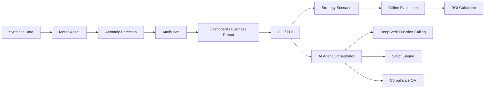

# RiskOps Copilot

面向消费金融贷后策略运营的 AI/Data Copilot Demo，用合成数据模拟指标监控、异常检测、归因、经营报告、策略评估与 ROI 测算，并接入 DeepSeek LLM 实现动态数据查询、话术推荐和合规质检。

> Public demo only：本项目只使用 synthetic data / 合成数据；不包含真实客户数据；不产生真实催收动作；不发送短信、语音或 WhatsApp；不做真实金融结论或 LLM 自动决策。

## Why This Project

贷后运营团队面对的典型问题不是"没有数据"，而是数据、指标、异常、归因和动作评估分散在不同工具里：

- **指标多**：回收率、PTP、触达、产能、投诉、减免 ROI 等指标口径容易分散。
- **异常发现慢**：经营波动往往先靠人工巡检、SQL 和 Excel 发现。
- **归因靠经验**：渠道、区域、客群、供应商、作业线和触达链路需要反复下钻。
- **动作缺少量化评估**：发现问题后，AI 外呼补强、人工产能、减免策略、资源再分配是否值得做，缺少统一的离线估算入口。
- **话术合规难自查**：催收话术的合规边界判断依赖人工，难以规模化。

RiskOps Copilot 把这条链路做成一个本地可运行的公开 Demo：从合成数据开始，经过指标资产、异常检测、归因、Dashboard、经营报告、策略评估和 ROI 测算，再进入 AI 对话式分析、话术推荐和合规质检。

## Product Workflow



## What It Demonstrates

- **数据工程能力**：合成贷后数据、五层分层数仓、数据质量验证和可复现本地输出。
- **指标体系建设**：以 `metadata/metric_dictionary.yaml` 作为指标口径来源，沉淀贷后经营指标资产。
- **异常检测**：识别 M1 回收率、AI 外呼覆盖、产能压力、减免使用、PTP 履约和投诉风险等信号。
- **归因分析**：围绕渠道、区域、客群分层、作业资源和过程证据解释 M1 D7 回收率下降。
- **经营分析报告**：将异常和归因转成管理者可读的 Markdown / HTML / Excel / PPT 多格式经营报告。
- **Dashboard**：输出本地静态 Dashboard，带 Portfolio at a Glance 导览和 AI+ML Fusion 架构说明。
- **CLI 产品化入口**：用命令行串联 summary、drivers、model-lab、roi、render-* 和 qc-scan 等所有 demo 动作。
- **策略评估**：基于合成数据和 M3 输出做离线策略情景估算，不训练真实模型。
- **ROI 测算**：基于 demo cost assumptions 估算成本、收益、ROI 和 payback，不代表真实财务结果。
- **TUI 对话终端**：Textual 交互式终端，接入 DeepSeek Function Calling，Agent 可动态查询底层 Parquet 数据后给出分析结论，而非读取静态文件。
- **Agent Orchestrator**：关键词路由分发到四个专家 Agent（风险分析 / 催收策略 / 合规质检 / 报告生成），各 Agent 有独立工具集和系统提示。
- **DeepSeek Function Calling**：10 个 DuckDB/pandas 查询工具（回收率 / 异常 / 归因驱动 / ROI 情景 / 供应商绩效 / 催收员绩效 / 客群细分 / 案件详情 / 催收过程 / 数据概览），支持多轮 FC 对话。
- **话术推荐引擎**：根据案件上下文生成合规催收话术草稿，内置频次检查（SMS 日≤2/周≤5）和关键词合规扫描，支持 DeepSeek 润色和 Mock 审批日志。
- **合规质检（QC）**：关键词扫描（5类违规词典）+ DeepSeek 11维合规评分，关键词红线强制覆盖 LLM 分数，无 API Key 时规则兜底。
- **合规边界意识**：隐私分级 P0–P4 强制边界，P4 字段（姓名/手机/身份证/地址）不进入 LLM 上下文。

## Demo Quick Start

这些命令读取或重新渲染本地 synthetic demo outputs；项目不包含真实客户数据，不用于生产风控决策。当前模型目标是 **D7 any-payment response**，不是 cure-to-current、全额回收或生产催收结果建模。

```bash
# 基础分析 CLI
python scripts/riskops_cli.py --help
python scripts/riskops_cli.py summary
python scripts/riskops_cli.py anomalies
python scripts/riskops_cli.py drivers
python scripts/riskops_cli.py model-lab
python scripts/riskops_cli.py render-dashboard
python scripts/riskops_cli.py render-report
python scripts/riskops_cli.py render-charts       # 输出 10 张 Plotly 图表

# 合规质检（关键词扫描，无需 API Key）
python scripts/riskops_cli.py qc-scan --texts "你赶快还钱" "我是法院，马上起诉你"

# 合规质检（LLM 11维，需要 DEEPSEEK_API_KEY）
export DEEPSEEK_API_KEY=your_key
python scripts/riskops_cli.py qc-scan --texts "话术内容" --use-llm

# 话术推荐引擎
python scripts/riskops_cli.py script --case-id CASE00000001 --channel sms
python scripts/riskops_cli.py script --case-id CASE00000001 --channel ai_call --use-llm --approve

# AI 管理层简报（LLM 模式，需要 DEEPSEEK_API_KEY）
python scripts/riskops_cli.py briefing --use-llm

# AI 对话终端（需要 DEEPSEEK_API_KEY）
python scripts/riskops_cli.py tui

# 全链路一键重跑
bash scripts/run_all.sh
pytest
```

常用入口说明：

- **--help**：查看当前 CLI 支持的全部 demo 入口。
- **summary**：查看项目状态、异常数量、数据边界和常用命令。
- **anomalies**：查看高优先级异常列表。
- **drivers**：查看 M1 D7 回收率下降 Top 5 drivers 和业务解释边界。
- **model-lab**：查看 M6 Strategy Evaluation / ROI 总览和 demo boundary。
- **render-charts**：输出 10 张 Plotly 交互图表（异常强度 / 归因贡献 / ROI 对比 / 催收漏斗 / 瀑布图 / 供应商矩阵 / 产能热图 / DPD 结构 / 减免 ROI / 投诉风险）。
- **qc-scan**：合规关键词扫描，加 `--use-llm` 启用 DeepSeek 11 维评分。
- **script**：根据案件 ID 生成合规话术草稿，加 `--use-llm` 启用 DeepSeek 润色，加 `--approve` 写入 Mock 审批日志。
- **tui**：启动 Textual 对话终端，AI Agent 可动态查询 Parquet 底层数据并流式输出分析结论。
- **run_all.sh**：从合成数据生成到全部输出一键重跑，任意步骤失败即 exit。
- **pytest**：运行当前 216 个测试，验证数据质量、隐私边界和 CLI 主链路。

## Key Outputs

- **Dashboard**：`outputs/dashboard/dashboard.html`
  - 首屏 Portfolio at a Glance（Business Problem / Data & Metric Layer / Anomaly Signals / Attribution / Strategy ROI Lab）、AI+ML Fusion 职责分层表与术语 glossary，便于无消费金融背景的访客 30 秒读懂。
- **Business Report**：`outputs/reports/m4_business_report.md` / `.html`
  - 面向经营复盘的异常、归因、过程证据和管理动作建议。
- **Excel Report**：`outputs/reports/m4_business_report.xlsx`
  - 4 个 Sheet：概览 / 异常信号 / 归因 Top5 / 策略ROI。
- **PPT Report**：`outputs/reports/m4_business_report.pptx`
  - 管理层汇报用 PowerPoint，`python scripts/riskops_cli.py render-ppt` 生成。
- **Strategy Evaluation**：`outputs/model_lab/strategy_eval_summary.md`
  - 5 个离线策略情景的 baseline / scenario / delta / caveats。
- **ROI Summary**：`outputs/model_lab/roi_summary.md`
  - 基于 demo cost assumptions 的成本、收益、ROI 和 payback 估算。
- **AI Briefing**（可选，需 DeepSeek API Key）：`outputs/copilot/briefing.md`
  - `briefing --use-llm` 生成中文管理层 AI 摘要；不加 `--use-llm` 则为确定性规则模板。
- **Visualization Charts**：`outputs/visualization/`
  - 10 张 Plotly 交互图表，`render-charts` 生成。
- **话术草稿**（需案件数据）：`outputs/script/approval_log.jsonl`
  - `script --approve` 将 Mock 审批记录追加到日志。
- **QC 质检报告**：CLI 实时输出或 `generate_qc_report` 写 Markdown；`--use-llm` 模式包含 11 维得分。

## Preview / 截图


| | |
|---|---|
|  |  |
|  |  |

完整截图索引见 [docs/screenshots/README.md](docs/screenshots/README.md)。`docs/architecture.md` 内的 Mermaid 图会在 GitHub 上原生渲染。

## Milestone Status

为避免终端截断，本节不用 Markdown 表格，改用分组列表呈现。

### v0.1.0 数据底座

- **阶段**：M1 Data Foundation
- **交付**：合成数据、分层数据目录、基础数据生成与隐私边界。
- **状态**：已发布。

### v0.2.0 指标资产

- **阶段**：M2 Metric Asset Layer
- **交付**：贷后 26 个指标字典、calculator registry、ADS 字段对齐。
- **状态**：已发布。

### v0.3.0 异常检测与归因

- **阶段**：M3 Anomaly Detection and Attribution
- **交付**：异常检测、M1 D7 回收率归因、结构化 M3 summary。
- **状态**：已发布。

### v0.4.0 Dashboard & Business Report

- **阶段**：M4 Dashboard and Reports
- **交付**：Static Dashboard、Business Report Renderer、Markdown / HTML 报告输出。
- **状态**：已发布。

### v0.5.0 CLI Interaction MVP

- **阶段**：M5 CLI / Demo Entry
- **交付**：统一 CLI 入口、summary、anomalies、drivers、outputs、render-dashboard、render-report。
- **状态**：已发布。

### v0.6.0 Model Lab Strategy Evaluation MVP

- **阶段**：M6 Strategy Evaluation / ROI
- **交付**：Strategy Scenario Schema、Offline Strategy Evaluator、ROI Calculator、Model Lab CLI integration。
- **状态**：已发布。

### v0.7.0 Demo Packaging（M7）

- **阶段**：M7 Demo Packaging
- **交付**：
  - M7-A State Recovery 可行性 guard
  - M7-B Dashboard Portfolio framing（Hero、5模块导览、AI+ML Fusion层、glossary）
  - M7-C 确定性 Briefing 生成器（规则模板，不调 LLM）
  - M7-D DeepSeek LLM 接入（`briefing --use-llm` 生成中文管理层摘要）
  - M7-E 全链路一键脚本（`scripts/run_all.sh`）
  - M7-F Excel 报告（`m4_business_report.xlsx`，4 个 Sheet）
  - M7-G 面试讲稿（`docs/interview_pitch.md`，5 分钟结构化 + 12 节追问）
  - M7-H Plotly 可视化补全（10 张图表，含催收漏斗 / 瀑布图 / 供应商矩阵 / 产能热图 / DPD 结构 / 减免 ROI / 投诉风险）
  - M7-I QC 合规关键词扫描（5 类违规词典，CLI `qc-scan`）
- **状态**：已发布。

### v0.8.0 AI 对话与催收智能（M8）

- **阶段**：M8 AI Agent + 话术引擎 + 合规 LLM
- **交付**：
  - M8-A DeepSeek Function Calling 动态数据查询（10 工具，多轮 FC）
  - M8-B Textual TUI 对话终端（`tui` 命令，流式输出，工具调用可视化）
  - M8-C Agent Orchestrator + 4 专家 Agent（风险分析 / 催收策略 / 合规质检 / 报告生成）
  - M8-D 话术推荐引擎（案件上下文 + 频次检查 + 合规扫描 + LLM 润色 + Mock 审批日志）
  - M8-E QC LLM 11维合规评分（DeepSeek 11维 + 关键词红线强制覆盖 + `--use-llm` CLI）
  - M8-F PPT 报告（`m4_business_report.pptx`，`render-ppt` 命令）
- **状态**：已发布。

## Boundaries

本项目的边界是公开 Demo 可信度的一部分：

- **synthetic data only**：只使用合成数据。
- **no real customer data**：不接入、不提交、不展示真实客户数据。
- **no real financial conclusion**：ROI 和收益只来自 demo assumptions，不代表真实财务结果。
- **no collection automation**：不产生真实催收动作。
- **no SMS / voice / WhatsApp**：不发送短信、语音或 WhatsApp。
- **no LLM decisioning**：LLM 输出仅供参考，不做自动策略决策，所有动作需人工确认。
- **no production claim**：不宣称真实上线、真实收益或真实催收自动化。
- **P4 隐私红线**：姓名 / 手机 / 身份证 / 地址不进入 LLM 上下文，由 Orchestrator 过滤。

## Current

- **Synthetic RiskOps demo** with D7 any-payment ML baseline (M6 model lab)。
- **C-score availability guard**：训练时强制 `score_date <= snapshot_date`，避免 future-leak。
- **Leakage-safe feature engineering**：只使用截至 snapshot 当日已可观测的特征。
- **State recovery target feasibility guard**（M7-A）：诊断 / 可行性检查，不是 production cure model。
- **AI Agent Orchestrator**（M8-C）：关键词路由到四个专家 Agent，支持 DeepSeek Function Calling 动态查询。
- **话术推荐引擎**（M8-D）：案件 context + 频次检查 + 合规扫描完整链路，人工审批兜底。
- **QC 11维合规评分**（M8-E）：关键词规则永远优先，LLM 作为补充维度，无 API Key 时规则兜底。

## Tech Stack（按模块对应）

只列当前公开 demo 实际使用的组件，不写远期方向。

- **pandas / DuckDB / Parquet**：合成数据生成、五层数仓与 ADS 宽表。
- **PyYAML**：`metadata/` 单一权威源（表、列、指标、隐私分级）。
- **scikit-learn**：Model Lab D7 any-payment baseline 与 leakage-safe 特征流程。
- **Jinja2 + static HTML / Plotly**：Dashboard、Business Report 渲染与 10 张交互图表。
- **Textual**：TUI 对话终端，流式渲染 Agent 输出与工具调用事件。
- **DeepSeek API**：Function Calling 动态查询、LLM 管理层摘要、话术润色和 11 维合规评分。
- **CLI（`scripts/riskops_cli.py`）**：demo 统一入口，覆盖分析 / 渲染 / 质检 / 话术 / TUI 所有命令。
- **pytest**：数据质量校验、跨层一致性、隐私边界、LLM mock 测试与 CLI 回归（216 个测试）。

## Project Entry Points

- **Architecture**：[docs/architecture.md](docs/architecture.md)
- **Interview Pitch**：[docs/interview_pitch.md](docs/interview_pitch.md)（5 分钟结构化讲稿 + 12 节追问）
- **ML Lab**：D7 any-payment baseline + leakage guard + score_date guard + vintage robustness
- **State Recovery**：feasibility guard only, not a production cure model

## Product Baseline

- **当前 PRD**：`docs/prd/PRD_v6.md`
- **当前发布**：v0.8.0（M8 AI Agent + 话术引擎 + 合规 LLM）
