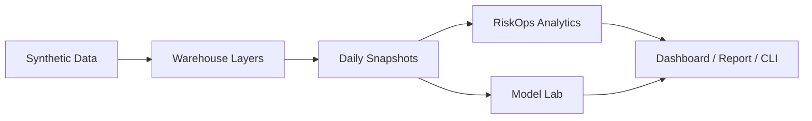

# Architecture

> Public demo only：本项目只使用 synthetic data / 合成数据；不接入真实客户数据；不做真实风控决策；不产生真实催收动作。

## Project Positioning

Synthetic post-loan RiskOps lab. 一个本地可运行的合成数据 demo，用来串联贷后经营的指标、异常、归因、报告、策略评估、ROI 和实验性 ML baseline，**不是生产风控系统**。

## High-Level Flow

## Layers

### 1. Data Layer

- **DIM**：维度（客户标签、渠道、区域、产品、催收作业线）
- **ODS**：合成原始事件（还款、外呼、PTP、投诉、减免等）
- **DWD**：明细加工（清洗、补齐主键、隐私分级）
- **DWS**：轻聚合（按日 / 按维度的累计指标）
- **ADS**：面向应用的最终宽表（指标计算、报告输入）

### 2. State Layer

- Daily snapshot at the **loan / case / customer** grain.
- 状态字段（DPD、bucket、stage 等）按当日观测构造，避免 future-leak。

### 3. Analytics Layer

- Anomaly detection
- Attribution / drivers
- Strategy scenarios (offline)
- ROI calculator (demo cost assumptions)

### 4. Model Lab

- **D7 any-payment baseline**：当前唯一 trainable baseline。
- **Leakage-safe feature columns**：训练只使用截至 snapshot 当日已可观测的特征。
- **C-score `score_date` availability guard**：强制 `score_date <= snapshot_date`，避免未来分入特征。
- **Vintage robustness**：按 vintage 分组复核，避免单段时间过拟合。
- **State recovery feasibility guard**（M7-A）：可行性 / leakage 诊断，**不是 production cure baseline**。

### 5. Output Layer

- CLI（`python scripts/riskops_cli.py ...`）
- Static dashboard（`outputs/dashboard/dashboard.html`）
- Business report（Markdown / HTML）
- Model lab outputs（`outputs/model_lab/*`）

## Boundaries

- synthetic data only / 合成数据
- no real customer data
- no production risk decisioning
- no real collection action
- no SMS / voice / WhatsApp
- no LLM decisioning
- current trainable baseline target is **D7 any-payment response**
- state recovery is **feasibility guard / diagnostic**, not a production cure model

## See Also

- [README.md](../README.md)
- [PRD v6](prd/PRD_v6.md)
- [Internal engineering notes](internal/README.md)
